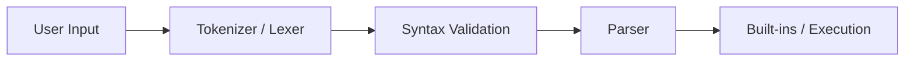

*This project has been created as part of the 42 curriculum by [maryaada], [walneama].*

# Description
Minishell is ...

A shell is ...


## Project Workflow
Every command entered into Minishell passes through the following stages:



## Lexer (Tokenization)

The lexer is responsible for transforming the raw input string into a sequence of tokens. Instead of processing the entire command as plain text, the lexer identifies meaningful elements such as:

- words
- pipes (|)
- input redirections (<)
- output redirections (>)
- append redirections (>>)
- heredocs (<<)


## Instructions

```text
┌──────────────────────────────────────────────┐
│ ●  ●  ●             Terminal                 │
├──────────────────────────────────────────────┤
│ maryaada@lab:~/minishell$ make               │
│ Compiling...                                 │
│ ....                                         │
│                                              │
│ maryaada@lab:~/minishell$ ./minishell        │
│ minishell$ pwd                               │
│ /home/maryaada/minishell                     │
│ minishell$                                   │
└──────────────────────────────────────────────┘
```